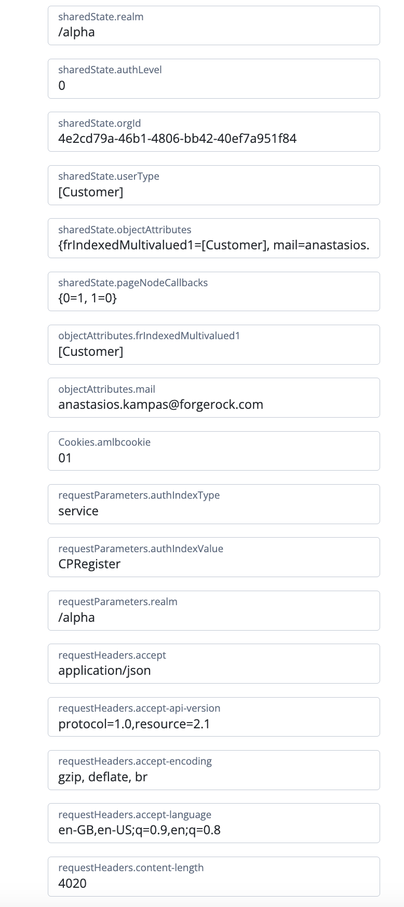

# Print debug node

## Introduction

JavaScript node that prints shared / transient state, object Attributes, requestHeaders / Cookies and request parameters.

## Contents

Create an AM scripted decision node using the node in the [src](src) directory

- print-debug.js

## Testing 

Add the scripted node after any node, the script will return as below:

